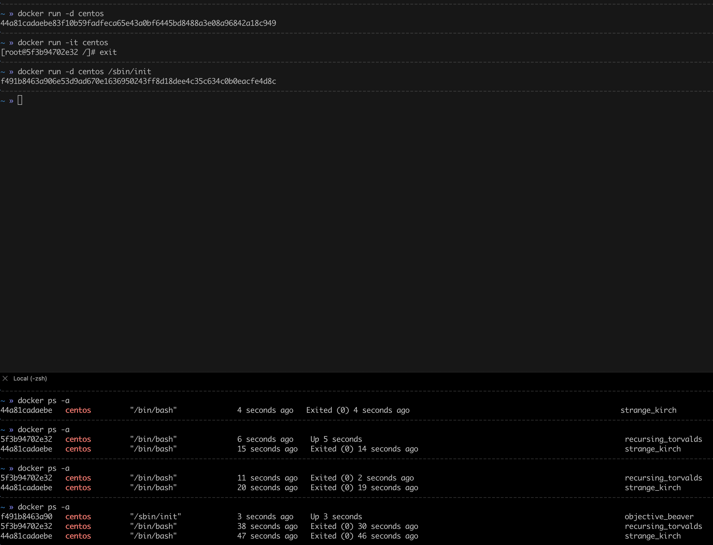
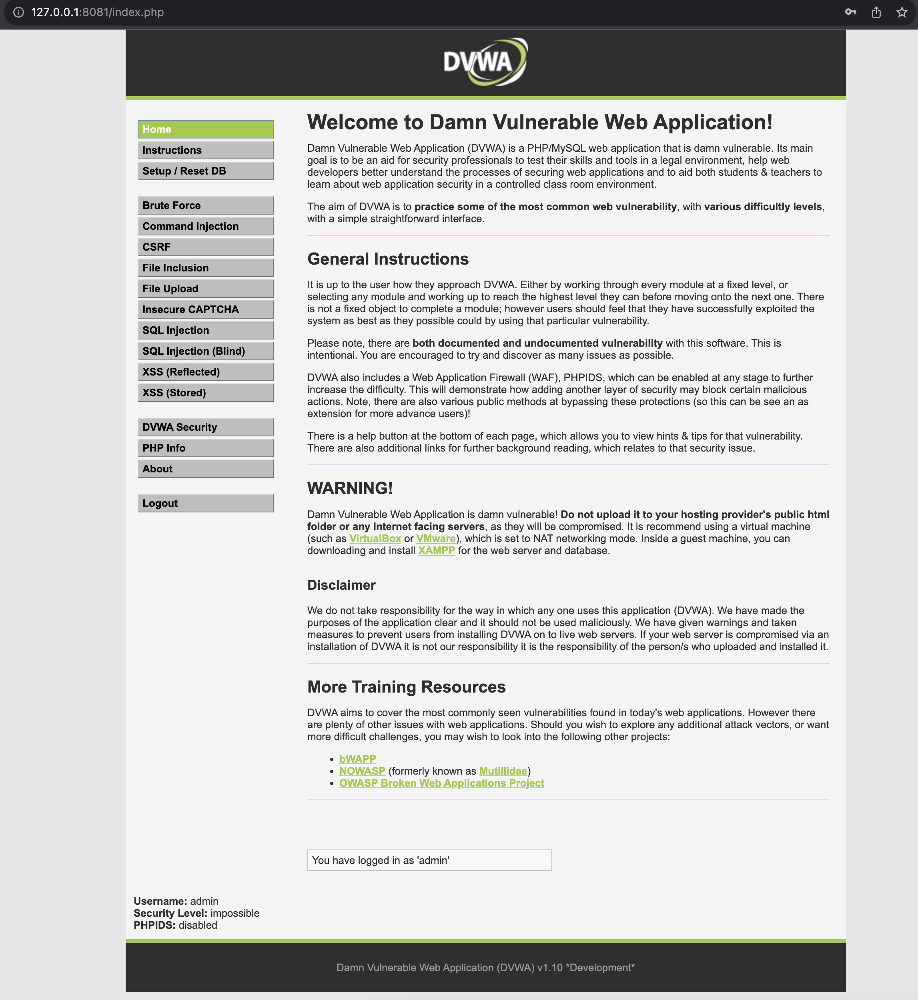
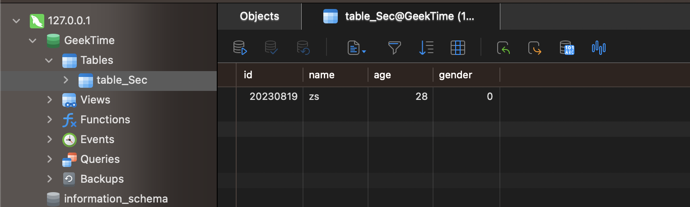

### 1. 在 docker 中分别以后台方式和交互方式启动 centos，对比启动后的容器状态，实现退出容器也能保持其运行状态。

后台直接启动的时候，容器会自动退出，交互方式启动的时候，容器会一直运行。
在后面加上/sbin/init，就可以保持容器一直运行。

### 2. 在 docker 并部署 DVWA，要求：DVWA web 端口映射到 8081，提供访问截图。

### 3、Mysql 练习
1. 创建一个名为"GeekTime"的数据库；
2. 在 GeekTime 数据库中创建一张名为"table_Sec"的表，要求有序号、姓名、年龄、性别字段；
3. 在 table_Sec 表中插入数据，序号是 20230819，姓名是拼音缩写，年龄、性别无要求 ;
4. 使用 Navicat 连接你所创建的数据库，查看个人信息并提供截图。

